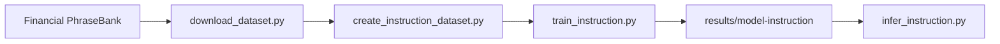

# Financial LLM Fine-Tuning

Fine-tune **Qwen2.5** on financial-domain text using **QLoRA** (Quantized Low-Rank Adaptation) to build a cost-efficient, domain-specialized language model for financial NLP tasks.

The project includes two tracks:

| Track | Task | Target output | Training script |
|-------|------|-----------------|-----------------|
| **V1** | Sentiment classification (single word) | `results/model` | `src/train.py` |
| **V2** | Financial instruction tuning (Sentiment + Reason) | `results/model-instruction` | `src/train_instruction.py` |

---

## V1 vs V2

Both tracks use [Financial PhraseBank](https://huggingface.co/datasets/lmassaron/FinancialPhraseBank) and QLoRA fine-tuning on `Qwen/Qwen2.5-0.5B-Instruct`. The difference is **what the model learns to generate**:

| | **V1 — Classification** | **V2 — Instruction tuning** |
|---|---|---|
| **Goal** | Predict a sentiment label | Classify sentiment **and explain why** |
| **User prompt** | "Classify the sentiment…" | "Analyze the sentiment… explain your reasoning" |
| **Model output** | `positive` | Structured response with Sentiment + Reason |
| **Data script** | `download_dataset.py` | `download_dataset.py` → `create_instruction_dataset.py` |
| **Train script** | `train.py` | `train_instruction.py` |
| **Infer script** | `inference.py` | `infer_instruction.py` |

**V1 example output:** `positive`

**V2 example output:**
```
Sentiment: Positive

Reason:
The company exceeded earnings expectations and reported strong financial performance.
```

See [`examples/instruction_examples.md`](examples/instruction_examples.md) for more V2 examples.

---

## Quick Start — V2 on Google Colab

Run from a **GPU runtime**. No data or model files are committed — everything is regenerated by the scripts.

```python
%cd /content
!rm -rf financial-llm-finetuning
!git clone https://github.com/YALINYAN-YU/financial-llm-finetuning.git
%cd financial-llm-finetuning

!pip install -q -r requirements-train.txt

!python src/download_dataset.py
!python src/create_instruction_dataset.py
!python src/train_instruction.py
!python src/infer_instruction.py
```

Each script prints the **next step** when it finishes successfully.

---

## V2 Workflow (step by step)

### Step 1 — Download dataset (V1 splits)

Creates raw Financial PhraseBank splits:

```
data/train.jsonl
data/validation.jsonl
data/test.jsonl
```

```bash
python src/download_dataset.py
```

### Step 2 — Create instruction dataset (V2 splits)

Reads V1 JSONL files and converts short labels into rich instruction-response pairs:

```
data/instruction/train.jsonl
data/instruction/validation.jsonl
data/instruction/test.jsonl
examples/instruction_examples.jsonl
```

```bash
python src/create_instruction_dataset.py
```

### Step 3 — Train LoRA adapter

QLoRA fine-tunes `Qwen/Qwen2.5-0.5B-Instruct` on V2 instruction data and saves:

```
results/model-instruction/
```

```bash
python src/train_instruction.py
```

### Step 4 — Run inference

Loads base model + LoRA adapter and runs 3 demo financial sentiment prompts:

```bash
python src/infer_instruction.py
```

---

## Project Overview

Large language models generalize well across many domains, but they often underperform on specialized financial language. This project demonstrates an end-to-end **parameter-efficient fine-tuning** workflow — data preparation, QLoRA training, inference, and evaluation — packaged as a reproducible codebase suitable for portfolio review.

**Tech stack:** PyTorch · Hugging Face Transformers · PEFT · bitsandbytes · TRL · Accelerate

---

## Architecture



| Component | Role |
|-----------|------|
| **Qwen2.5-Instruct** | Base causal language model |
| **4-bit Quantization (NF4)** | Frozen base weights via `bitsandbytes` |
| **LoRA Adapters** | Trainable low-rank matrices in attention + MLP layers |
| **TRL SFTTrainer** | Supervised fine-tuning with assistant-only loss |

---

## Dataset formats

### V1 (`data/train.jsonl`)

```json
{
  "sentence": "Operating profit was EUR 139.7 mn, up 23 % from EUR 113.8 mn .",
  "label": 2,
  "instruction": "Classify the sentiment...",
  "output": "positive"
}
```

### V2 (`data/instruction/train.jsonl`)

```json
{
  "instruction": "Analyze the sentiment of the following financial news sentence...",
  "input": "Apple reported record earnings.",
  "output": "Sentiment: Positive\n\nReason:\nThe company exceeded earnings expectations...",
  "sentence": "Apple reported record earnings.",
  "label": 2,
  "sentiment": "positive"
}
```

---

## Setup

**Local (Mac) — dataset download only:**

```bash
python -m venv .venv
source .venv/bin/activate
pip install -r requirements.txt
python src/download_dataset.py
python src/create_instruction_dataset.py
```

**Colab / Kaggle — full V2 pipeline:**

```bash
pip install -r requirements-train.txt
```

---

## V1 Pipeline (legacy)

```bash
python src/download_dataset.py
python src/train.py
python src/evaluate.py --model-path results/model --eval-file data/test.jsonl
```

---

## Experiment Results (V1 smoke test)

| | |
|---|---|
| **Dataset** | Financial PhraseBank |
| **Task** | Financial sentiment classification |
| **Base model** | `Qwen/Qwen2.5-0.5B-Instruct` |
| **Method** | QLoRA — 4-bit NF4 + LoRA adapters |
| **Hardware** | NVIDIA T4 (Google Colab) |
| **Train loss** | 0.3853 |
| **Validation loss** | 0.1906 |
| **Validation token accuracy** | **92.67%** |

> **Note:** Trained LoRA adapters, checkpoints, and generated `data/` splits are **not committed to GitHub**. Clone the repo and run the pipeline scripts to regenerate everything.

---

## Project Structure

```
financial-llm-finetuning/
├── README.md
├── requirements.txt
├── requirements-train.txt
├── examples/
│   ├── instruction_examples.md      # V2 documentation (committed)
│   └── instruction_examples.jsonl   # Sample prompts (committed + regenerated)
├── data/                            # Generated — not committed
│   ├── train.jsonl                  # V1
│   └── instruction/                 # V2
├── src/
│   ├── download_dataset.py
│   ├── create_instruction_dataset.py
│   ├── train_instruction.py
│   ├── infer_instruction.py
│   ├── train.py                     # V1
│   ├── inference.py                 # V1
│   └── evaluate.py
└── results/                         # Model artifacts — not committed
    ├── model/                       # V1 adapter
    └── model-instruction/           # V2 adapter
```

---

## Troubleshooting

| Error | Fix |
|-------|-----|
| `V1 dataset files not found` | `python src/download_dataset.py` |
| `V2 instruction dataset not found` | Run download + `python src/create_instruction_dataset.py` |
| `Trained LoRA adapter not found` | `python src/train_instruction.py` |
| `Run this script from the project root` | `cd financial-llm-finetuning` first |

---

## License

This project is intended for research and portfolio demonstration. Verify the license terms of the base Qwen2.5 model and any datasets used before commercial deployment.
