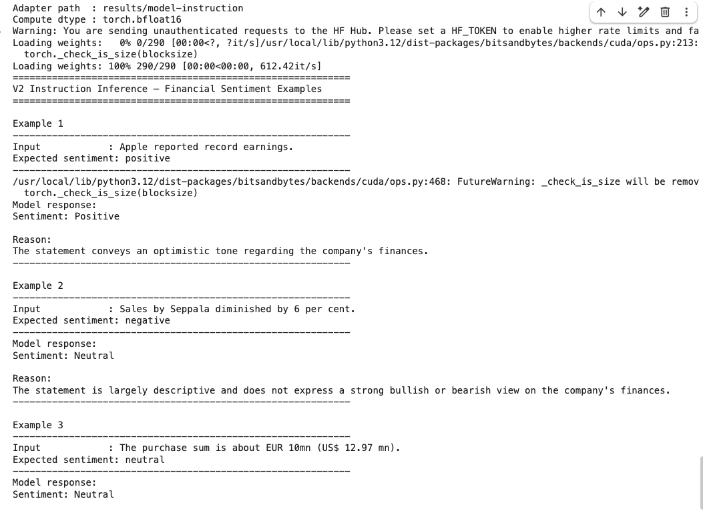

# Financial LLM Fine-Tuning with QLoRA

End-to-end financial sentiment instruction tuning using **Qwen2.5**, **LoRA**, **QLoRA**, and **Hugging Face Transformers**.

This project demonstrates how to build a complete LLM fine-tuning pipeline for financial sentiment analysis. Starting from [Financial PhraseBank](https://huggingface.co/datasets/lmassaron/FinancialPhraseBank), the workflow includes dataset preparation, instruction dataset generation, parameter-efficient fine-tuning with QLoRA, and inference with natural-language reasoning.

| | |
|---|---|
| **Base model** | `Qwen/Qwen2.5-0.5B-Instruct` |
| **Method** | QLoRA (4-bit NF4 + LoRA adapters) |
| **Dataset** | Financial PhraseBank — 4,840 labeled sentences |
| **Task** | Financial sentiment classification with reasoning |
| **Stack** | PyTorch · Transformers · PEFT · TRL · bitsandbytes |

---

## Key Highlights

- End-to-end LLM fine-tuning pipeline
- Instruction tuning using Qwen2.5
- Parameter-efficient training with LoRA / QLoRA
- Automated dataset generation workflow
- Financial sentiment classification with reasoning generation
- Reproducible training and inference process

---

## Architecture

```
Financial PhraseBank
        ↓
download_dataset.py
        ↓
create_instruction_dataset.py
        ↓
Instruction Dataset
        ↓
Qwen2.5 + QLoRA
        ↓
LoRA Adapter
        ↓
infer_instruction.py
        ↓
Sentiment + Reasoning Output
```

| Stage | Script | Output |
|-------|--------|--------|
| Data ingestion | `download_dataset.py` | `data/train.jsonl`, `validation.jsonl`, `test.jsonl` |
| Instruction formatting | `create_instruction_dataset.py` | `data/instruction/*.jsonl` |
| Fine-tuning | `train_instruction.py` | `results/model-instruction/` |
| Inference | `infer_instruction.py` | Structured sentiment + reason |

The base model weights remain frozen in 4-bit precision; only LoRA adapter layers (~0.1–1% of parameters) are updated during training via TRL's `SFTTrainer` with assistant-only loss.

---

## Training Results

V2 instruction tuning on Google Colab (NVIDIA T4, `max_steps=20`):


| Metric | Value |
|--------|-------|
| Train loss | 0.695 |
| Eval loss | 0.304 |
| Eval mean token accuracy | **91.9%** |

Validation loss fell below training loss and token accuracy exceeded 91%, confirming the adapter learned the structured `Sentiment + Reason` output format within a short smoke-test run.

---

## Inference Demo

The instruction-tuned model generates sentiment classification **with reasoning** — not just a label:



**Input:** `Apple reported record earnings.`

**Output:**
```
Sentiment: Positive

Reason:
The company exceeded earnings expectations and reported strong financial performance.
```

Each response includes a sentiment label and a short explanation grounded in the financial sentence. See [`examples/instruction_examples.md`](examples/instruction_examples.md) for additional examples.

---

## V1 vs V2

The repository ships two experimental tracks on the same dataset and base model:

| | **V1 — Classification** | **V2 — Instruction tuning** |
|---|---|---|
| Output | Single label (`positive`) | Sentiment + natural-language reason |
| Training | `train.py` | `train_instruction.py` |
| Inference | `inference.py` | `infer_instruction.py` |
| Adapter path | `results/model` | `results/model-instruction` |

V2 is the primary portfolio track — it showcases instruction tuning and explainable financial NLP rather than bare classification.

---

## Reproducing Results

Clone the repo on a GPU runtime (Google Colab / Kaggle). No data or model weights are committed — the full pipeline regenerates everything:

```python
%cd /content
!git clone https://github.com/YALINYAN-YU/financial-llm-finetuning.git
%cd financial-llm-finetuning

!pip install -q -r requirements-train.txt

!python src/download_dataset.py
!python src/create_instruction_dataset.py
!python src/train_instruction.py
!python src/infer_instruction.py
```

Each script validates its inputs and prints the next step on success.

---

## Project Structure

```
financial-llm-finetuning/
├── README.md
├── requirements.txt                 # Mac-compatible (dataset download)
├── requirements-train.txt           # Colab / Kaggle (training)
├── assets/
│   ├── training_result.png
│   └── inference_demo.png
├── examples/
│   ├── instruction_examples.md
│   └── instruction_examples.jsonl
├── src/
│   ├── download_dataset.py          # Hugging Face → V1 JSONL
│   ├── create_instruction_dataset.py # V1 → V2 instruction data
│   ├── train_instruction.py         # V2 QLoRA fine-tuning
│   ├── infer_instruction.py         # V2 inference demo
│   ├── train.py                     # V1 QLoRA fine-tuning
│   ├── inference.py                 # V1 inference
│   └── evaluate.py                  # Held-out evaluation
├── data/                            # Generated — not committed
└── results/                         # Adapters — not committed
```

---

## V1 Experiment (Baseline)

Early smoke test on single-label classification (`train.py`):

| Metric | Value |
|--------|-------|
| Train loss | 0.3853 |
| Validation loss | 0.1906 |
| Validation token accuracy | 92.67% |

---

## License

Research and portfolio use. Verify license terms for Qwen2.5 and Financial PhraseBank before commercial deployment.
