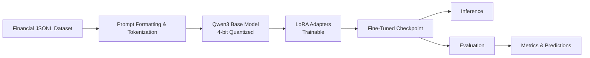

# Financial LLM Fine-Tuning

Fine-tune **Qwen3** on financial-domain text using **QLoRA** (Quantized Low-Rank Adaptation) to build a cost-efficient, domain-specialized language model for financial NLP tasks.

---

## Project Overview

Large language models generalize well across many domains, but they often underperform on specialized financial language — earnings terminology, regulatory filings, ratio analysis, and market commentary require targeted adaptation. Training a full model from scratch is prohibitively expensive; full fine-tuning of a 7B+ parameter model is often impractical on consumer hardware.

This project demonstrates an end-to-end **parameter-efficient fine-tuning** workflow that adapts Qwen3 to financial text while keeping GPU memory requirements low. The pipeline covers data preparation, QLoRA training, inference, and quantitative evaluation — packaged as a reproducible, modular codebase suitable for portfolio review and technical interviews.

**Key outcomes this project showcases:**

- Applying modern PEFT techniques (QLoRA) to adapt a state-of-the-art open-weight model
- Designing an instruction-tuning pipeline for domain-specific NLP
- Building a clean, script-driven ML project structure with separate train / infer / eval stages
- Measuring model quality with structured evaluation outputs

**Tech stack:** PyTorch · Hugging Face Transformers · PEFT · bitsandbytes · TRL · Accelerate

---

## Architecture

The system follows a standard **adapt → train → evaluate → deploy** pattern. The base Qwen3 weights remain frozen in 4-bit precision; only lightweight LoRA adapter layers are updated during training.



| Component | Role |
|-----------|------|
| **Qwen3** | Base causal language model providing general reasoning and language capabilities |
| **4-bit Quantization (NF4)** | Loads the frozen base model in low precision via `bitsandbytes`, reducing VRAM usage by ~4× |
| **LoRA Adapters** | Low-rank matrices injected into attention layers (`q_proj`, `v_proj`); only ~0.1–1% of parameters are trained |
| **Instruction Template** | Structured `Instruction / Input / Response` format for supervised fine-tuning |
| **Hugging Face Trainer** | Orchestrates training loops, checkpointing, and mixed-precision execution |

This design makes it feasible to fine-tune a multi-billion-parameter model on a single GPU while preserving most of the base model's general knowledge.

---

## Dataset

Training data is stored in `data/` as **JSONL** files — one JSON object per line. Each record follows an instruction-tuning schema suited to financial NLP:

| Field | Description |
|-------|-------------|
| `instruction` | Task description or question (e.g., *"Explain the debt-to-equity ratio"*) |
| `input` | Optional context — a sentence, paragraph, or filing excerpt |
| `output` | Target response the model should learn to generate |

**Example record:**

```json
{
  "instruction": "Summarize the key financial risks disclosed in this excerpt.",
  "input": "The Company faces interest rate exposure on its $2.1B floating-rate debt...",
  "output": "Primary risks include interest rate sensitivity on floating-rate debt, potential covenant breaches under adverse market conditions, and concentration in commercial real estate lending."
}
```

**Supported task types** (extensible via the same schema):

- Financial question answering and concept explanation
- Earnings call and SEC filing summarization
- Sentiment and tone analysis of financial text
- Named entity and metric extraction from reports

Recommended split: `data/train.jsonl` for training, `data/eval.jsonl` for held-out evaluation. Exploratory analysis and data profiling can be done in `notebooks/`.

---

## Training Pipeline

The pipeline is implemented across three scripts in `src/` and produces artifacts in `results/`.

```
data/train.jsonl
      │
      ▼
┌─────────────┐     ┌──────────────────┐     ┌─────────────────┐
│  train.py   │ ──▶ │ results/         │ ──▶ │  inference.py   │
│  QLoRA SFT  │     │ checkpoints/     │     │  Generate text  │
└─────────────┘     └──────────────────┘     └─────────────────┘
                           │
                           ▼
                    ┌─────────────┐
                    │ evaluate.py │
                    │  Metrics    │
                    └─────────────┘
                           │
                           ▼
                    results/eval/
```

**Training steps (`train.py`):**

1. Load Qwen3 base model with 4-bit quantization and attach LoRA adapters via PEFT
2. Load and tokenize the financial instruction dataset (max sequence length configurable)
3. Run supervised fine-tuning with the Hugging Face `Trainer` (mixed-precision when GPU is available)
4. Save adapter weights and tokenizer to `results/checkpoints/`

**Default hyperparameters:**

| Parameter | Default | Notes |
|-----------|---------|-------|
| LoRA rank (`r`) | 16 | Controls adapter capacity |
| LoRA alpha | 32 | Scaling factor for adapter updates |
| Learning rate | 2e-4 | Standard for LoRA fine-tuning |
| Epochs | 3 | Adjust based on dataset size |
| Batch size | 4 | Increase with gradient accumulation if VRAM allows |
| Max sequence length | 512 | Increase for longer filing excerpts |

### Setup

```bash
python -m venv .venv
source .venv/bin/activate   # Windows: .venv\Scripts\activate
pip install -r requirements.txt
```

### Run training

```bash
python src/train.py \
  --model-name Qwen/Qwen3-8B \
  --train-file data/train.jsonl \
  --output-dir results/checkpoints
```

### Run inference

```bash
python src/inference.py \
  --model-path results/checkpoints \
  --prompt "What are the main components of a cash flow statement?"
```

### Run evaluation

```bash
python src/evaluate.py \
  --model-path results/checkpoints \
  --eval-file data/eval.jsonl \
  --output-dir results/eval
```

---

## Evaluation Metrics

Model quality is assessed on a held-out evaluation set using `evaluate.py`. Results are written to `results/eval/` as structured JSON for reproducibility and downstream analysis.

| Metric | Description |
|--------|-------------|
| **Exact Match (EM)** | Fraction of predictions that exactly match the reference answer (case-insensitive). Useful as a strict baseline for short-form QA. |
| **Num Examples** | Count of evaluation samples processed |

**Outputs:**

- `results/eval/metrics.json` — aggregate scores
- `results/eval/predictions.jsonl` — per-example predictions with references for error analysis

For generative financial tasks where exact string match is too strict, predictions can be further scored with **ROUGE-L**, **BERTScore**, or **LLM-as-judge** evaluation — see [Future Improvements](#future-improvements).

Inference uses greedy decoding by default during evaluation (`temperature=0.0`) to ensure deterministic, comparable results.

---

## Future Improvements

| Area | Planned Enhancement |
|------|---------------------|
| **Quantization** | Formalize 4-bit NF4 loading in `train.py` with `BitsAndBytesConfig` for full QLoRA compliance |
| **Evaluation** | Add ROUGE, BERTScore, and task-specific metrics (F1 for extraction tasks) |
| **Data** | Integrate public financial corpora (FiQA, Financial PhraseBank, SEC filings) with automated preprocessing |
| **Training** | Gradient accumulation, learning-rate scheduling, and early stopping based on validation loss |
| **Serving** | Export merged adapter weights and deploy via vLLM or Hugging Face TGI for low-latency inference |
| **Safety** | Add disclaimer generation and hallucination checks for financial advice scenarios |
| **Experiment tracking** | Integrate Weights & Biases or MLflow for run comparison and hyperparameter sweeps |
| **Notebooks** | Add EDA and ablation studies in `notebooks/` to document data quality and LoRA rank experiments |

---

## Project Structure

```
financial-llm-finetuning/
├── README.md
├── requirements.txt
├── data/              # Raw and processed datasets (train.jsonl, eval.jsonl)
├── notebooks/         # Exploratory analysis and experiments
├── src/
│   ├── train.py       # QLoRA fine-tuning script
│   ├── inference.py   # Text generation with fine-tuned model
│   └── evaluate.py    # Held-out evaluation and metrics export
└── results/           # Checkpoints, logs, and evaluation outputs
```

---

## License

This project is intended for research and portfolio demonstration. Verify the license terms of the base Qwen3 model and any datasets used before commercial deployment.
