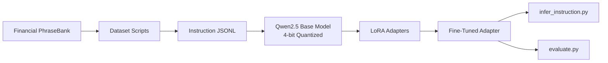

# Financial LLM Fine-Tuning

Fine-tune **Qwen2.5** on financial-domain text using **QLoRA** (Quantized Low-Rank Adaptation) to build a cost-efficient, domain-specialized language model for financial NLP tasks.

The project includes two tracks:

| Track | Task | Output |
|-------|------|--------|
| **V1** | Sentiment classification (single-label) | `results/model` |
| **V2** | Financial instruction tuning (Sentiment + Reason) | `results/model-instruction` |

---

## Project Overview

Large language models generalize well across many domains, but they often underperform on specialized financial language — earnings terminology, regulatory filings, ratio analysis, and market commentary require targeted adaptation. Training a full model from scratch is prohibitively expensive; full fine-tuning of a 7B+ parameter model is often impractical on consumer hardware.

This project demonstrates an end-to-end **parameter-efficient fine-tuning** workflow that adapts Qwen2.5 to financial text while keeping GPU memory requirements low. The pipeline covers data preparation, QLoRA training, inference, and quantitative evaluation — packaged as a reproducible, modular codebase suitable for portfolio review.

**Key outcomes this project showcases:**

- Applying modern PEFT techniques (QLoRA) to adapt a state-of-the-art open-weight model
- Designing an instruction-tuning pipeline for domain-specific NLP
- Building a clean, script-driven ML project structure with separate train / infer / eval stages
- Measuring model quality with structured evaluation outputs

**Tech stack:** PyTorch · Hugging Face Transformers · PEFT · bitsandbytes · TRL · Accelerate

---

## Architecture

The system follows a standard **adapt → train → infer → evaluate** pattern. The base Qwen2.5 weights remain frozen in 4-bit precision; only lightweight LoRA adapter layers are updated during training.



| Component | Role |
|-----------|------|
| **Qwen2.5-Instruct** | Base causal language model |
| **4-bit Quantization (NF4)** | Frozen base weights via `bitsandbytes`, ~4× VRAM savings |
| **LoRA Adapters** | Trainable low-rank matrices in attention + MLP layers |
| **Instruction Template** | User prompt + structured assistant response |
| **TRL SFTTrainer** | Supervised fine-tuning with assistant-only loss |

---

## Dataset

Data is sourced from [Financial PhraseBank](https://huggingface.co/datasets/lmassaron/FinancialPhraseBank) — 4,840 English financial news sentences labeled negative, neutral, or positive.

### V1 format (`data/train.jsonl`)

Short classification labels:

```json
{
  "sentence": "Operating profit was EUR 139.7 mn, up 23 % from EUR 113.8 mn .",
  "label": 2,
  "instruction": "Classify the sentiment...",
  "output": "positive"
}
```

### V2 format (`data/instruction/train.jsonl`)

Rich instruction-tuning responses with reasoning:

```json
{
  "instruction": "Analyze the sentiment of the following financial news sentence...",
  "input": "Apple reported record earnings.",
  "output": "Sentiment: Positive\n\nReason:\nThe company exceeded earnings expectations and reported strong financial performance.",
  "sentence": "Apple reported record earnings.",
  "label": 2,
  "sentiment": "positive"
}
```

See [`examples/instruction_examples.md`](examples/instruction_examples.md) for full prompt/response examples.

---

## Pipelines

### V1 — Sentiment classification

```bash
# 1. Download dataset
python src/download_dataset.py

# 2. Train (QLoRA)
python src/train.py

# 3. Evaluate
python src/evaluate.py \
  --model-path results/model \
  --eval-file data/test.jsonl
```

### V2 — Financial instruction tuning

```bash
# 1. Download dataset (if not already present)
python src/download_dataset.py

# 2. Convert labels → rich instruction responses
python src/create_instruction_dataset.py

# 3. Train instruction model
python src/train_instruction.py

# 4. Run demo inference (3 examples)
python src/infer_instruction.py
```

**V2 pipeline diagram:**

```
download_dataset.py
        │
        ▼
create_instruction_dataset.py  ──▶  data/instruction/*.jsonl
        │
        ▼
train_instruction.py           ──▶  results/model-instruction/
        │
        ▼
infer_instruction.py             ──▶  Sentiment + Reason responses
```

---

## Setup

**Local (Mac) — dataset download only:**

```bash
python -m venv .venv
source .venv/bin/activate
pip install -r requirements.txt
python src/download_dataset.py
```

**Colab / Kaggle — training and inference:**

```bash
pip install -r requirements-train.txt
```

---

## Experiment Results (V1)

A smoke-test run on Google Colab validated the full training pipeline — from dataset loading through LoRA adapter export.

| | |
|---|---|
| **Dataset** | Financial PhraseBank |
| **Task** | Financial sentiment classification |
| **Base model** | `Qwen/Qwen2.5-0.5B-Instruct` |
| **Method** | QLoRA — 4-bit NF4 + LoRA adapters |

### Smoke test setup

| Setting | Value |
|---------|-------|
| Hardware | NVIDIA T4 GPU (Google Colab) |
| Training steps | 20 (`max_steps=20`) |
| Train examples | 3,872 |
| Validation examples | 484 |
| Batch size | 1 (gradient accumulation: 4) |
| Max sequence length | 256 |

### Metrics

| Metric | Value |
|--------|-------|
| Train loss | 0.3853 |
| Validation loss | 0.1906 |
| Validation token accuracy | **92.67%** |
| Output | LoRA adapter saved to `results/model` |

> **Note:** Trained LoRA adapter files are **not committed to GitHub** because model artifacts can be large. This repository focuses on **reproducible training code** and **experiment documentation** — regenerate adapters by running the pipeline scripts on a GPU environment.

---

## Evaluation Metrics

Model quality is assessed on a held-out evaluation set using `evaluate.py`. Results are written to `results/eval/` as structured JSON.

| Metric | Description |
|--------|-------------|
| **Exact Match (EM)** | Fraction of predictions matching the reference (case-insensitive) |
| **Num Examples** | Count of evaluation samples processed |

For V2 instruction outputs, task-level metrics (sentiment F1, ROUGE on reasons) can be added — see [Future Improvements](#future-improvements).

---

## Future Improvements

| Area | Planned Enhancement |
|------|---------------------|
| **V2 evaluation** | Sentiment F1 and ROUGE/BERTScore on generated reasons |
| **Training** | Full-epoch V2 runs and larger base models (Qwen2.5-3B) |
| **Data** | FiQA, SEC filings, multi-task instruction mixtures |
| **Serving** | Merge adapters and deploy via vLLM or Hugging Face TGI |
| **Safety** | Disclaimer generation and hallucination checks |
| **Experiment tracking** | Weights & Biases or MLflow integration |

---

## Project Structure

```
financial-llm-finetuning/
├── README.md
├── requirements.txt              # Mac-compatible (dataset download)
├── requirements-train.txt        # Colab/Kaggle (training)
├── examples/
│   ├── instruction_examples.md   # V2 prompt/response documentation
│   └── instruction_examples.jsonl
├── data/                         # Generated — not committed
│   ├── train.jsonl               # V1 splits
│   └── instruction/              # V2 splits
├── src/
│   ├── download_dataset.py       # Download Financial PhraseBank
│   ├── create_instruction_dataset.py  # V1 → V2 conversion
│   ├── train.py                  # V1 QLoRA training
│   ├── train_instruction.py      # V2 QLoRA instruction tuning
│   ├── infer_instruction.py      # V2 demo inference
│   ├── inference.py              # V1 inference
│   └── evaluate.py               # Evaluation
└── results/                      # Model artifacts — not committed
    ├── model/                    # V1 adapter
    └── model-instruction/        # V2 adapter
```

---

## License

This project is intended for research and portfolio demonstration. Verify the license terms of the base Qwen2.5 model and any datasets used before commercial deployment.
